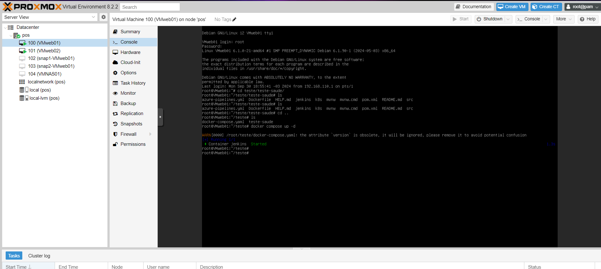
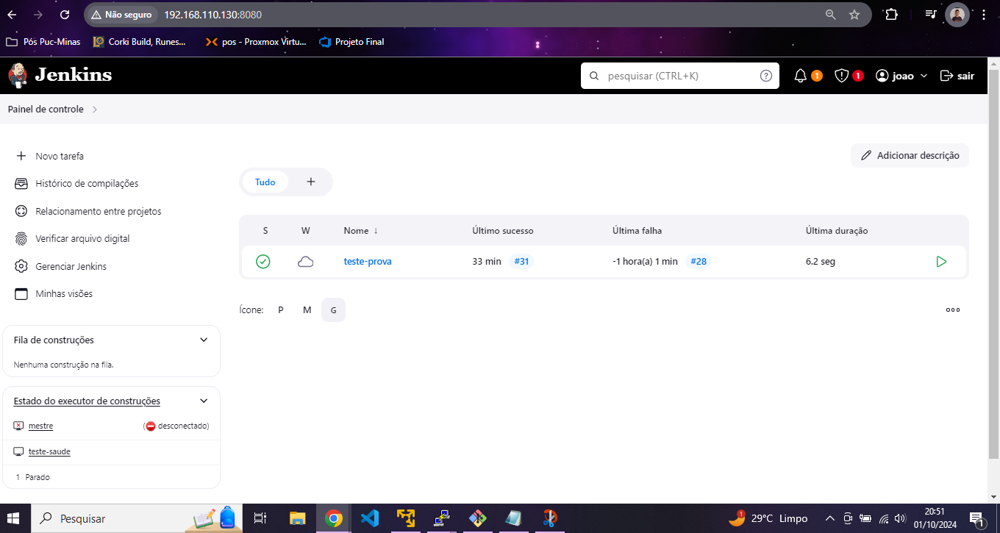

1- Criação do Cluster no Proxmox

O primeiro nó VMweb01 foi onde subi um compose do jenkins para realizar o teste, o segundo nó VMweb02 está o Compose do NGINX e tambem configurei um agent nesse servidor 

2- Jenkins com o no agent e com o job

